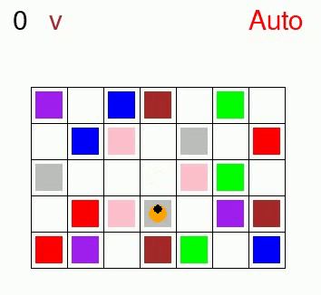
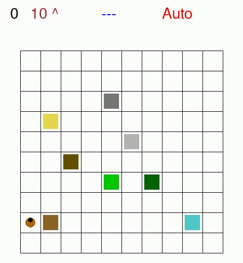

# Reinforcement Learning examples using RLTG

In this repository you can find some examples of Reinforcement Learning tasks (with temporally extended goals) by using the [RLTG](https://github.com/MarcoFavorito/rltg) framework.

Further details in [this document](https://github.com/MarcoFavorito/master-thesis/blob/1.0.0/thesis.pdf) (Chapter 8: Experiments).

### Breakout: remove bricks in a given order

The goal is given by using temporal logic formulas.

Examples of temporal goals can be:

- columns from left to right


- rows from the bottom to the top


- Both from the top to the bottom and from right to left


### Sapientino: visit colors in order




### Minecraft: learn to accomplish composite tasks




## Repository structure

You have three command line utilities:
- `train.py`: a command-line utility to run a training job. Usage (`python train.py --help`):

      usage: train.py [-h] [--algorithm {q-learning,sarsa}] [--episodes EPISODES]
                [--gamma GAMMA] [--alpha ALPHA] [--epsilon EPSILON]
                [--lambda LAMBDA_] [--reward_shaping] [--on_the_fly]
                [--render] [--datadir DATADIR] [--verbosity {0,1,2}]
                ENVIRONMENT ...

    ...

- `resume.py`: resume a previously stopped training job. Run `python resume.py --help` to see the usage.

- `eval.py`: run the learnt policy. Run `python eval.py --help` to see the usage.

Other stuff:

- `scripts/`: contains a set of preconfigured experiments, used for benchmarking among different configurations.
- `plots/`: contains some plots of the benchmarking. Please refer to Chapter 8 of this [thesis](https://github.com/MarcoFavorito/master-thesis/blob/1.0.0/thesis.pdf).


You can use three environments (the implementation in [this repo](https://github.com/MarcoFavorito/RLgames)):

- Breakout: Reimplementation of the well-known Atari game.
- Sapientino: a kid game where pairs of colors have to be matched.
- Minecraft: a 2D implementation of a Minecraft-like environment.

For details about the possible parameters for every environment, run `python train.py {environment_name} --help`, e.g.:

    python train.py breakout --help

## Examples

In this section we show how to run the examples and the various configurations.

We recommend to use [Pipenv](https://pipenv.readthedocs.io/en/latest/) to configure a virtual environment:

    pipenv --python 3.7 && pipenv shell
    pipenv install 

### Breakout

Training (Breakout environment):


    python train.py --gamma 0.999 --lambda 0.99 --reward_shaping --datadir my_experiment breakout --temp_goal cols


Other configurations:

```
# q-learning, reward shaping, but no temporal goals. Use the reduced feature space (only the difference of the x coordinate between the ball and the paddle). 
python train.py --algorithm q-learning  --episodes 1000 --gamma 0.999 --lambda 0.99 --reward_shaping --datadir my_experiment breakout --robot_feature_space S

# sarsa, reward shaping, 3x4, removing columns from left to right (right to left is the default)
python train.py --algorithm sarsa  --episodes 1000 --gamma 0.999 --lambda 0.99 --reward_shaping --datadir my_experiment breakout --brick_rows 3 --brick_cols 4 --temp_goal cols --left_right

# reward shaping with on-the-fly construction, remove rows from the top to the bottom. Show the automata transitions in the log messages (verbosity=2).
python train.py --gamma 0.999 --lambda 0.99 --reward_shaping --on_the_fly --datadir my_experiment --verbosity 2 breakout --temp_goal rows 
```

### Sapientino

   
    python train.py --gamma 1.0 --lambda 0.0 --alpha 0.1 --epsilon 0.1 --reward_shaping  --datadir my_experiment sapientino --temp_goal colors


### Minecraft
    
    python train.py --gamma 0.99 --lambda 0.9 --alpha 0.1 --epsilon 0.20 --reward_shaping  --datadir my_experiment minecraft --temp_goal all

## Evaluation:

    python eval.py --render --datadir my_experiment

## Resume the training job:

    python resume.py --datadir my_experiment

## Plot results

Plot result (reward per episode with moving average):

    python scripts/plot.py my_experiment
    
